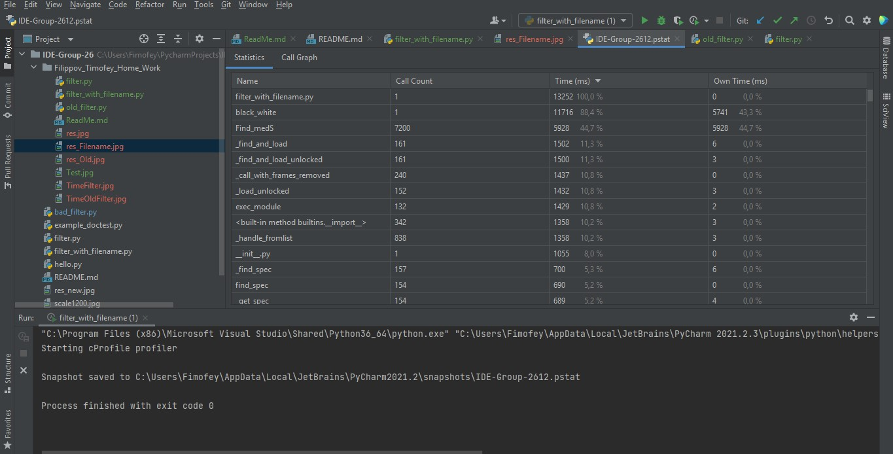

Время выполнения filter.py

Время выполнения old_filter.py

Разница во времени выполнения связана с тем, что в обычном филтре значения вводятся в ручную, но даже в таком виде, он обганяят менее продвинутый филтер, ведь в нем содержатся серьезные ошибки.
Время выполнения filter_with_filename.py

Данный код, выполняется быстрее двух предыдущих, так как он в отличии от old_filter.py оптимизированн и не затрачивает время на ожидание ввода значений, как filter.py.

Исходное изображение.

После filter.py

После old_filter.py

После filter_with_filename.py

Doc-тесты с ошибкой прохождения, которая по моему мнению вызванна постоянно меняющимися данными, которые передаются в тест.

Свойствах изображения ширину и высоту, а также тип изображения.
